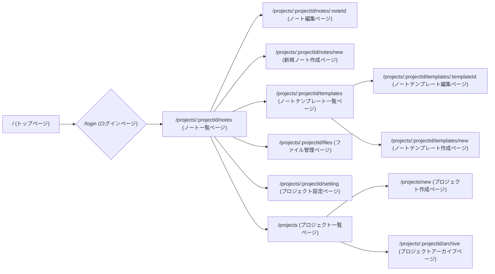

# 要件定義書 - 実装詳細（UI/UX）

## 実装詳細

### 1.1 URL設計

- **ルートパス**: `/` (トップページ)
- **ログインページ**: `/login` (ログインページ)
  - 環境変数がTrueだったらID/パスワードでのログイン
  - Google OAuthログイン
- **ノート一覧ページ**: `/projects/:projectId/notes` (ノート一覧ページ)
  - 新規ノート作成ページへ遷移するためのボタン
  - ノート一覧表示
  - ノート編集ページへの遷移
  - 検索機能
    - 検索できる要素
      - ノートタイトル
      - ノートの内容
      - タグ
    - 検索結果の表示は表示されているノート一覧にフィルターがかかるイメージで表示する
  - ノートテンプレート作成
  - ノートテンプレート呼び出し
- **ノート編集ページ**: `/projects/:projectId/notes/:noteId` (ノート編集ページ)
  - タイトル入力
  - ノート編集
  - ノート削除
  - ノートテンプレート呼び出し
  - 同じタグが付いているノートの表示
  - ノート名と完全一致するタグをつけているノートの表示
- **新規ノート作成ページ**: `/projects/:projectId/notes/new` (新規ノート作成ページ)
  - タイトル入力
  - ノート編集
  - ノート作成
  - ノートテンプレート呼び出し
- **プロジェクト一覧ページ**: `/projects` (プロジェクト一覧ページ)
  - プロジェクト一覧表示
  - プロジェクト編集ページへの遷移
  - プロジェクト作成ページへの遷移
  - プロジェクトアーカイブページへの遷移
  - プロジェクト検索
- **プロジェクト設定ページ**: `/projects/:projectId/setting` (プロジェクト設定ページ)
  - プロジェクト名の変更
  - プロジェクトのアーカイブ
  - プロジェクトの削除
- **プロジェクトアーカイブページ**: `/projects/:projectId/archive` (プロジェクトアーカイブページ)
  - プロジェクトアーカイブ
  - プロジェクトの復元
- **プロジェクト作成ページ**: `/projects/new` (プロジェクト作成ページ)
  - プロジェクト名の入力
  - プロジェクト作成
- **ファイル管理ページ**: `/projects/:projectId/files` (ファイル管理ページ)
  - ファイル一覧表示
  - ファイルの削除
  - ノートのエクスポート/インポート機能
- **ユーザー設定**: `/user/settings` (ユーザー設定ページ)
  - ユーザ名変更
  - パスワード変更
- **ノートテンプレート一覧ページ**: `/projects/:projectId/templates` (ノートテンプレート一覧ページ)
  - ノートテンプレート一覧表示
  - ノートテンプレート作成ページへの遷移
  - ノートテンプレート編集ページへの遷移
  - ノートテンプレートの削除
- **ノートテンプレート作成ページ**: `/projects/:projectId/templates/new` (ノートテンプレート作成ページ)
  - ノートテンプレート名の入力
  - ノートテンプレート作成
- **ノートテンプレート編集ページ**: `/projects/:projectId/templates/:templateId` (ノートテンプレート編集ページ)
  - ノートテンプレート名の変更
  - ノートテンプレートの削除

### 1.2 画面遷移図

